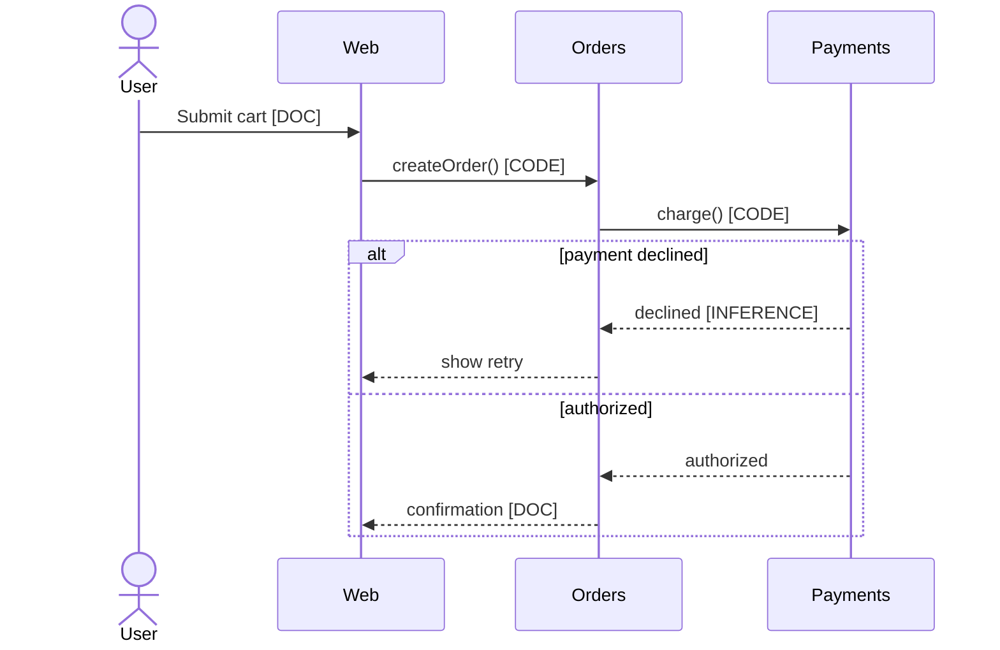

<!-- distilled from alfa skills/flow-mapping -->
<!-- DDD domain taxonomy + 8-12 end-to-end business flows. Sequence diagrams (Mermaid). Bounded contexts. Integration matrix. [EXPLICIT] -->
# flow-mapping {Analysis} (v1.1)
> **"Analyze with evidence. Every claim tagged. Every finding actionable."**
## Purpose
DDD domain taxonomy + 8-12 end-to-end business flows. Sequence diagrams (Mermaid). Bounded contexts. Integration matrix. [EXPLICIT]
**When to use:** Analysis mode (MAO DNA), after AS-IS exists, before architecture/development. [EXPLICIT]
**Anti-scope (do NOT do here):** target architecture, API contracts, data schemas, sprint plans, cost/FTE estimates — those are plan/architecture deliverables (Art. 1.5 phase separation). Flow-mapping describes *what happens today end-to-end*, not what to build. [EXPLICIT]

## Core Principles
1. **Law of Evidence:** Every finding tagged [CODE], [CONFIG], [DOC], [INFERENCE], or [ASSUMPTION] (R-001). A flow step asserting system behavior needs [CODE]/[CONFIG]; a step asserting human process needs [DOC]/[INFERENCE]. [EXPLICIT]
2. **Law of Completeness:** Ship only with all required sections covered: taxonomy, 8-12 flows, bounded contexts, integration matrix, evidence summary. [EXPLICIT]
3. **Law of Firebase Lens:** Each integration/persistence touchpoint annotated with Firebase/Google/Hostinger feasibility. [EXPLICIT]

## What "a flow" is (record schema)
An end-to-end business flow = a complete value path from a triggering event to a terminal outcome, crossing ≥1 bounded context. Each flow record carries: [EXPLICIT]
| Field | Content | Evidence rule |
|-------|---------|---------------|
| ID / Name | `F-NN` + verb-noun (e.g. F-03 Checkout-Order) | — |
| Trigger | Event/actor that starts it | [DOC] or [CODE] |
| Actors | Human roles + systems | [DOC]/[INFERENCE] |
| Happy path | Ordered steps, each tagged | per-step tag |
| Alt/error paths | ≥1 failure branch + handling | [INFERENCE] ok |
| Bounded contexts touched | From taxonomy | [INFERENCE] |
| Data crossing boundaries | Key entities exchanged | [CODE]/[DOC] |
| Terminal outcome | Success state + side effects | [DOC] |

**Selecting 8-12:** rank candidate flows by (business criticality × frequency × cross-context reach). Always include the revenue/core-value flow, the primary onboarding flow, and ≥1 failure-prone or compliance-sensitive flow. <8 → domain under-explored (gather more); >12 → you are mapping features, not flows (merge variants into alt-paths). [INFERENCE]

## Core Process
### Phase 1: Gather
1. Collect inputs (docs, code, conversations, existing systems). [EXPLICIT]
2. Parse for triggers, actors, requirements, constraints, context. [EXPLICIT]
### Phase 2: Analyze
1. Derive DDD domain taxonomy → bounded contexts (group by language + ownership boundary, not by table). [EXPLICIT]
2. Identify candidate flows; rank and pick 8-12 (selection rule above). [EXPLICIT]
3. Trace each flow step-by-step; tag every step with evidence. [EXPLICIT]
4. Build the integration matrix (every cross-context call/event). [EXPLICIT]
### Phase 3: Document
1. Produce markdown deliverable: taxonomy, flow records, Mermaid sequence diagrams, integration matrix. [EXPLICIT]
2. Include evidence-tag summary (% by tag type). [EXPLICIT]
3. If >30% [ASSUMPTION], add WARNING banner. [EXPLICIT]

## Mermaid sequence convention
One `sequenceDiagram` per flow. Participants = bounded contexts/systems (not classes). Use `alt`/`opt` for branches, `Note over` for evidence tags, `-->>` for async/events vs `->>` sync. Keep ≤12 messages — split sub-flows if longer. [EXPLICIT]

## Integration matrix
One row per cross-context interaction. Columns: Source context · Target context · Mechanism (REST/event/DB/file) · Sync/Async · Payload entity · Coupling (tight/loose) · Firebase-feasibility note. Every arrow that crosses a bounded-context line in a sequence diagram MUST appear as a matrix row, and vice versa — this consistency check catches hidden integrations. [EXPLICIT]

## Inputs / Outputs
| Input | Type | Required | Description |
|-------|------|----------|-------------|
| Project context | Text/Files | Yes | What to analyze |
| AS-IS / domain notes | Text/Files | No | Speeds taxonomy; absence raises [ASSUMPTION] ratio |

| Output | Type | Description |
|--------|------|-------------|
| Flow-mapping deliverable | Markdown | Taxonomy + 8-12 flows + Mermaid + integration matrix, evidence-tagged |

## Validation Gate
- [ ] 8-12 end-to-end flows, each with happy path + ≥1 alt/error path
- [ ] Every flow has a Mermaid sequence diagram (≤12 messages each)
- [ ] DDD taxonomy + bounded contexts defined
- [ ] Integration matrix complete; matches every cross-context arrow (both directions)
- [ ] Every step/finding has an evidence tag; Firebase feasibility noted on integrations
- [ ] No implementation details (phase separation, Art. 1.5)
- [ ] Actionable recommendations included; follows R-008 output standards

## Self-Correction Triggers
> [!WARNING]
> IF >30% claims are [ASSUMPTION] THEN add prominent WARNING banner and list the top gaps to close.
> IF analysis contains implementation details THEN move them to plan (Art. 1.5).
> IF a sequence-diagram arrow has no matrix row (or vice versa) THEN reconcile before shipping.
> IF flow count <8 THEN gather more domain input; IF >12 THEN merge variants into alt-paths.

## Usage
Example invocations:
- "/flow-mapping" — Run the full flow mapping workflow
- "flow mapping on this project" — Apply to current context

## Assumptions & Limits
- Assumes access to project artifacts (code, docs, configs); thinner access shifts findings toward [INFERENCE]/[ASSUMPTION]. [EXPLICIT]
- English-language output unless otherwise specified. [EXPLICIT]
- Does not replace domain-expert judgment for final decisions. [EXPLICIT]
- Captures AS-IS flows only — not target/redesigned flows (that is architecture). [EXPLICIT]

## Edge Cases
| Scenario | Handling |
|----------|----------|
| Empty or minimal input | Request clarification before proceeding |
| Conflicting requirements | Flag conflicts explicitly, propose resolution |
| Out-of-scope request | Redirect to appropriate skill or escalate |
| Monolith, no clear contexts | Derive contexts from ubiquitous language + ownership seams; tag [INFERENCE] |
| >12 candidate flows | Merge variants into alt-paths of a parent flow |
| Undocumented integration found in code | Add matrix row, tag [CODE], flag for owner confirmation |
| Cyclic flows (A triggers B triggers A) | Split at the async boundary; model each leg as its own flow |
