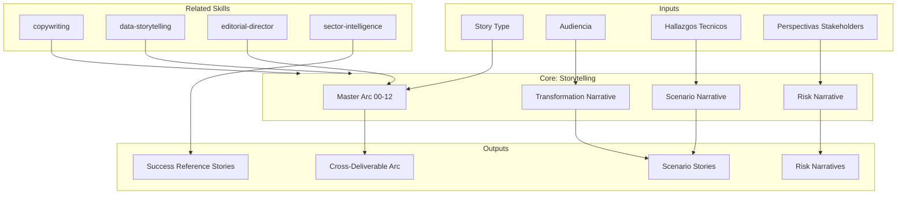

<!-- distilled from alfa skills/storytelling -->
<!-- Narrative arc design and transformation metodologia-storytelling for discovery deliverables. [EXPLICIT] -->
# Storytelling — Narrative Arc & Transformation Stories

Designs the narrative architecture that transforms raw analysis into compelling transformation stories. Owns story arcs across deliverables, scenario narratives, risk stories, and evidence-based transformation narratives. [EXPLICIT]

## Grounding Guideline

**Data informs. Stories transform.** A technical finding is a data point. A finding wrapped in context, consequence, and a path to action is a story that moves people to act. Storytelling does not decorate data — it gives data the narrative structure so the reader remembers, understands, and acts.

### Narrative Philosophy

1. **Every story has tension.** Without conflict there is no narrative. The conflict in discovery is: current state vs. desired state. The gap is the story. [EXPLICIT]
2. **Characters are real.** The end user, the operator, the decision-maker — each one experiences the gap differently. Their perspectives enrich the narrative. [EXPLICIT]
3. **Evidence is the anchor.** A story without data is fiction. Data without a story is noise. Storytelling unites them. [EXPLICIT]
4. **The arc spans all deliverables.** From Plan (00) to Handover (09), there is ONE narrative arc: discovery → revelation → decision → transformation. [EXPLICIT]

## Inputs

- `$1` — Story type: `transformation`, `scenario`, `risk`, `success`, `cross-deliverable` (default: `transformation`)
- `$2` — Audience: `executive`, `technical`, `mixed` (default: `mixed`)

Parse from `$ARGUMENTS`. [EXPLICIT]

## Narrative Architectures

### Master Arc (Cross-Deliverable)

```
00 Plan        → "Nos comprometemos a descubrir la verdad del sistema"
01 Stakeholders → "Estas son las personas que viven con el sistema"
02 Brief       → "El panorama en 3 minutos"
03 AS-IS       → "La realidad técnica, sin adornos"      ← TENSIÓN MÁXIMA
04 Flows       → "Así fluye (o no fluye) el valor"
05 Scenarios   → "Tres futuros posibles"                  ← PUNTO DE DECISIÓN
06 Roadmap     → "El camino elegido, step by step"
07 Spec        → "Lo que vamos a construir, exactamente"
08 Pitch       → "Por qué actuar ahora"                   ← CALL TO ACTION
09 Handover    → "Cómo empezar el lunes"                  ← RESOLUCIÓN
10 Hallazgos   → "Lo que descubrimos, para quien decide"
11 Recomendac. → "Lo que recomendamos, y por qué"
12 IA Opport.  → "Cómo la IA acelera la transformación"
```

### Transformation Narrative (Per-Deliverable)

```
Act 1: Current State (Pain)
  ├── Contextualize: "El equipo de [N] personas dedica [X]% de su tiempo a..."
  ├── Quantify: "[Y] incidentes/mes, [Z] horas de workaround"
  └── Personalize: "El operador de turno debe..."

Act 2: Decision Point (Tension)
  ├── Fork: "Si no se actúa: [COI projection]"
  ├── Options: "Tres caminos posibles..."
  └── Evidence: "Basado en [tags], recomendamos..."

Act 3: Future State (Resolution)
  ├── Vision: "En 12 meses, el equipo podrá..."
  ├── Metrics: "Time-to-market de [X] a [Y], disponibilidad de [A]% a [B]%"
  └── First step: "Sprint 0 comienza con..."
```

### Scenario Narrative (Deliverable 05)

Each scenario is a **plausible future**, not just a technical option:

```
Scenario [Name]:
  "Imagine que en 18 meses..."
  ├── Vivid future: What daily work looks like
  ├── How we got here: Key decisions and investments
  ├── What we gained: Quantified benefits
  ├── What it cost: FTE-months, trade-offs
  └── What we risked: Identified risks and mitigations
```

### Risk Narrative (Not Fear-Mongering)

```
Pattern: Consequential Thinking
  "Si [riesgo] se materializa → [impacto cuantificado] →
   [cascada de consecuencias] → [punto de no retorno en N meses]"

Tone: Factual, not alarmist
  ❌ "El sistema colapsará"
  ✅ "Con la tendencia actual de [X] incidentes/mes creciendo [Y]%,
      el equipo alcanzará capacidad de respuesta máxima en Q3,
      requiriendo [Z] FTE adicionales para mantener SLAs"
```

### Success Reference Stories

```
Pattern: Industry Analogy
  "[Empresa comparable en sector] enfrentó [dolor similar]. [EXPLICIT]
   Con [enfoque seleccionado], logró [resultado cuantificado] en [plazo]. [EXPLICIT]
   Nuestro escenario B sigue un patrón similar, adaptado a [contexto cliente]."

Source: metodologia-sector-intelligence skill provides benchmarks
```

## Narrative Techniques

| Technique | When to Use | Example |
|-----------|-------------|---------|
| **Contrast** | Before/after, AS-IS vs TO-BE | "Hoy: 12 semanas. Mañana: 4 semanas." |
| **Escalation** | Building urgency | Finding → implication → cascade → crisis |
| **Analogy** | Making technical tangible | "Es como renovar una casa habitada" |
| **Perspective** | Multi-stakeholder | "Para el desarrollador... Para el PM... Para el CTO..." |
| **Progression** | Building the case | Evidence 1 + Evidence 2 + Evidence 3 = Conclusion |
| **Callback** | Cross-deliverable coherence | "Como vimos en 03_AS-IS § Acoplamiento..." |

**Failure modes per technique** (what breaks the technique): [EXPLICIT]

- **Contrast** fails when the "after" number is unsourced — reader reads it as a sales promise, not evidence. Anchor every TO-BE metric to a scenario assumption tagged `[SUPUESTO]`.
- **Escalation** fails when it skips a rung (finding → crisis with no implication/cascade between) — reads as fear-mongering. Each rung must be one quantified step from the prior.
- **Analogy** fails when the analogy is closer to the writer's world than the reader's ("es como un microservicio…" to a CFO). Pick the analogy from the *audience's* domain.
- **Callback** fails when the referenced section was cut or renamed — produces a dangling cross-reference. Verify the anchor exists before shipping; if a deliverable is absent (partial discovery), drop the callback rather than reference a missing section.

## Audience Tone Calibration

The Validation Gate requires "Tone calibrated (Executive ≠ technical ≠ mixed)" but the differences are otherwise implicit. Concrete contract: [EXPLICIT]

| Dimension | `executive` | `technical` | `mixed` |
|-----------|-------------|-------------|---------|
| Lead with | Business consequence + decision | Evidence + mechanism | Consequence, then evidence |
| Evidence depth | Headline metric + 1 tag | Full tag chain, file/line refs | Headline + drill-down callout |
| FTE/cost framing | FTE-months + ROI horizon (never prices) | Effort breakdown by component | FTE-months, summarized |
| Jargon | Avoid; analogy from business domain | Precise technical terms expected | Define on first use |
| Length per act | ≤1 paragraph | As needed for rigor | Layered: summary + optional depth |
| Risk tone | Consequential, factual | Probabilistic, mechanistic | Consequential with evidence anchor |

Trade-off: a `mixed` narrative is longer (it serves two readers). When length is constrained, default to `executive` framing with technical detail in callouts/appendices, not inline. [INFERENCIA]

## Thread Management

Narrative threads that must be consistent across ALL deliverables:

| Thread | Introduced In | Resolved In |
|--------|--------------|-------------|
| Technical debt cost | 03 AS-IS | 06 Roadmap, 08 Pitch |
| User pain | 01 Stakeholders, 04 Flows | 07 Spec, 09 Handover |
| Risk exposure | 03 AS-IS | 05 Scenarios, 08 Pitch |
| Value proposition | 05 Scenarios | 06 Roadmap, 08 Pitch |
| Transformation path | 05 Scenarios | 06 Roadmap, 09 Handover |

## Output Configuration

- **Language**: Spanish (Latin American, business register — simple, clear, concise, direct)
- **Attribution**: Expert committee of the MetodologIA Discovery Framework
- **Tagline**: *"Construido por profesionales, potenciado por la red agéntica de MetodologIA."*

## Validation Gate

| Criterion | Check (acceptance = pass condition) |
|-----------|-------|
| Narrative arc present | All 3 acts present and labeled; each act has ≥1 sentence of tension/decision/resolution |
| Evidence-grounded | Every quantified claim carries a tag; every tagged data point serves a narrative beat (no orphan numbers) |
| Cross-references active | Each active thread (Thread Management table) has ≥1 callback between intro and resolution deliverable; no dangling references to absent sections |
| Personalization present | ≥1 named stakeholder perspective per major finding; perspective references a real role from 01 Stakeholders |
| Tone calibrated | Lead-with, evidence depth, and jargon match the Audience Tone Calibration row for `$2` |
| No orphan stories | Every thread in Thread Management resolved by 08 Pitch or 09 Handover; a partial-discovery arc resolves within its available terminal deliverable |
| No green-as-success | Positive metrics framed as evidence toward a decision, never as a self-congratulatory verdict |

## Assumptions & Limits

- Los hallazgos tecnicos ya existen como input; esta skill estructura la narrativa, no genera datos.
- Las historias deben estar ancladas en evidencia. Especulacion debe llevar tag [SUPUESTO] explicito.
- Esta skill posee **estructura narrativa y arcos de historia**. NO posee calidad de prosa (eso es copywriting) ni narrativas de visualizacion de datos (eso es data-storytelling).
- El arco maestro cubre entregables 00-12. Si el discovery es parcial, adaptar el arco a los entregables disponibles.

## Edge Cases

| Caso Borde | Estrategia de Manejo |
|---|---|
| Cliente sin analisis previo (discovery desde cero) | Construir narrativa exclusivamente desde analisis de codigo. Enmarcar como "el discovery revela lo que el codigo nos dice". Usar la ausencia de documentacion como tension narrativa. |
| AS-IS positivo (sistema en buen estado, caso raro) | Buscar tension en escalabilidad, costo de oportunidad, o presion competitiva. "El sistema funciona hoy, pero el crecimiento proyectado de X% lo llevara al limite en Y meses." |
| Multiples streams de transformacion en paralelo | Tejer narrativas paralelas con punto de resolucion compartido. Usar tecnica de "callback" entre streams. Crear timeline visual que muestre convergencia. |
| Audiencia hostil o esceptica al cambio | Liderar con datos incuestionables [CODIGO]. Evitar recomendaciones tempranas. Construir caso acumulativamente: evidencia 1 + 2 + 3 = conclusion inevitable. Incluir "devil's advocate" section. |
| Discovery parcial (faltan entregables del arco 00-12) | Adaptar el arco maestro a los entregables disponibles; el thread debe resolverse en el entregable terminal presente (no en uno ausente). No dejar threads huerfanos apuntando a secciones que no se generaran. |
| Thread sin resolucion al llegar a Pitch/Handover | Es un defecto, no un caso valido. O se resuelve el thread, o se reclasifica explicitamente como riesgo abierto con tag [SUPUESTO] y owner asignado. Nunca silenciarlo. |
| Datos contradictorios entre entregables (ej. AS-IS dice X, Flows dice Y) | No promediar ni ocultar. Convertir la contradiccion en tension narrativa explicita y escalar a editorial-director para reconciliar la fuente. |

## Decisions & Trade-offs

| Decision | Justificacion | Alternativa Descartada |
|---|---|---|
| Arco narrativo unico cross-deliverable (00-12) | Coherencia total: cada entregable avanza la historia. El stakeholder percibe un argumento acumulativo, no documentos aislados. | Entregables narrativamente independientes: pierden fuerza acumulativa; el lector no conecta hallazgos. |
| Tension como motor narrativo obligatorio | Sin conflicto no hay narrativa. La brecha entre estado actual y estado deseado es el motor que mueve al lector hacia la decision. | Narrativa descriptiva sin tension: informativa pero no accionable; no motiva decision. |
| Evidencia como ancla de toda historia | Diferencia storytelling de ficcion. El lector ejecutivo detecta narrativas sin sustento y pierde confianza. | Historias sin datos: percibidas como opinion; pierden credibilidad con audiencias tecnicas. |
| Perspectiva multi-stakeholder | Enriquece la narrativa mostrando como el mismo problema afecta a diferentes roles. Genera empatia cross-funcional. | Perspectiva unica: pierde a parte de la audiencia; no refleja complejidad organizacional. |

## Knowledge Graph



## Output Templates

### Template 1: Transformation Narrative (Markdown)

**Filename:** `Narrative_{project}_{deliverable}_{WIP|Aprobado}.md`

```markdown
# Narrativa de Transformacion: {project}

## Acto 1: Estado Actual (Dolor)
### Contexto
{Equipo de [N] personas dedica [X]% de su tiempo a...}

### Cuantificacion
{[Y] incidentes/mes, [Z] horas de workaround}

### Perspectiva Humana
{El operador de turno debe... El desarrollador enfrenta...}

## Acto 2: Punto de Decision (Tension)
### Sin Accion
{Proyeccion COI: costo acumulado en N trimestres}

### Opciones
{3 caminos posibles con trade-offs}

### Evidencia
{Tags y datos que soportan la recomendacion}

## Acto 3: Estado Futuro (Resolucion)
### Vision
{En 12 meses, el equipo podra...}

### Metricas Objetivo
{Time-to-market de [X] a [Y], disponibilidad de [A]% a [B]%}

### Primer Paso
{Sprint 0 comienza con...}
```

### Template 2: Scenario Narrative (Markdown)

**Filename:** `Scenario_Narrative_{project}_{scenario}_{WIP|Aprobado}.md`

```markdown
# Escenario {Name}: {project}

## "Imagine que en 18 meses..."
{Descripcion vivida del futuro: como se ve el trabajo diario}

## Como Llegamos Aqui
{Decisiones clave e inversiones realizadas}

## Que Ganamos
| Beneficio | Metrica Actual | Metrica Proyectada | Evidencia |
|---|---|---|---|

## Que Costo
{FTE-meses, trade-offs explicitos, que se sacrifico}

## Que Arriesgamos
| Riesgo | Probabilidad | Impacto | Mitigacion |
|---|---|---|---|
```

### Template 3: HTML (bajo demanda)

- Filename: `{fase}_Narrative_{project}_{WIP|Aprobado}.html`
- Estructura: HTML self-contained branded (Design System MetodologIA v5). Dark-First Executive. Incluye timeline visual del arco maestro (00-12), cards de escenario con tensión/resolución, y sección de callbacks cross-entregable. WCAG AA, responsive, print-ready.

### Template 4: DOCX (bajo demanda)

- Filename: `{fase}_storytelling_{cliente}_{WIP}.docx`
- Generado con python-docx y MetodologIA Design System v5. Portada con tipo de historia y audiencia, TOC automático, encabezados Poppins navy, cuerpo Trebuchet MS, acentos dorados, tablas zebra. Secciones: Arco Maestro (cross-deliverable), Narrativa de Transformación (3 actos), Narrativas de Escenario, Narrativas de Riesgo, Success Reference Stories.

### Template 5: PPTX (bajo demanda)

- Filename: `{fase}_storytelling_{cliente}_{WIP}.pptx`
- Generado con python-pptx y MetodologIA Design System v5. Slide master con gradiente navy, títulos Poppins, cuerpo Trebuchet MS, acentos dorados. Máximo 20 slides (ejecutiva). Speaker notes con referencias de evidencia. Slides: Portada, Arco Maestro (00-12 timeline visual), Acto 1: Estado Actual (dolor cuantificado), Acto 2: Punto de Decisión (opciones y evidencia), Acto 3: Estado Futuro (visión y métricas objetivo), Narrativas de escenario (una por escenario relevante), Risk Narrative (consecuencias cuantificadas), Success Reference Story, próximos pasos.

### Template 6: XLSX (bajo demanda)

- Filename: `{fase}_storytelling_{cliente}_{WIP}.xlsx`
- Generado via openpyxl con MetodologIA Design System v5. Encabezados con fondo navy y texto Poppins blanco, cuerpo en Trebuchet MS, zebra striping en filas. Hojas: Narrative Arc (entregable 00-12, tensión introducida, resolución, estado del thread), Thread Tracker (thread narrativo, entregable de introducción, entregable de resolución, estado activo/resuelto/pendiente), Scenario Narratives (escenario, visión futura, beneficio cuantificado, costo FTE-meses, riesgo principal), Risk Narratives (riesgo, consecuencia cuantificada, cascada de impacto, punto de no retorno). Conditional formatting por estado de threads (activo/resuelto/pendiente) y audiencia. Auto-filters en todas las hojas. Valores directos sin fórmulas.

## Evaluacion

| Dimension | Peso | Criterio |
|---|---|---|
| Trigger Accuracy | 10% | Se activa ante solicitudes de narrativa, arco de historia, transformation story, o scenario narrative |
| Completeness | 25% | Arco narrativo completo (tension -> decision -> resolucion), threads consistentes cross-deliverable, perspectiva multi-stakeholder |
| Clarity | 20% | Narrativa fluida; transiciones logicas entre actos; el lector entiende la progresion sin saltos |
| Robustness | 20% | Produce narrativas efectivas sin analisis previo, con AS-IS positivo, con audiencia esceptica |
| Efficiency | 10% | Genera estructura narrativa completa con parametros minimos (tipo + audiencia) |
| Value Density | 15% | Cada elemento narrativo aporta tension o resolucion; cero prosa decorativa sin funcion narrativa |

**Umbral minimo: 7/10**

## Cross-References

- `metodologia-copywriting` — Calidad de prosa y persuasion dentro de cada seccion narrativa
- `metodologia-data-storytelling` — Interpretacion de metricas que alimenta la narrativa
- `metodologia-editorial-director` — Coordinacion del arco maestro cross-entregable
- `metodologia-sector-intelligence` — Benchmarks y analogias sectoriales para success reference stories

## Worked Example: Data Point → Story (Risk Narrative, executive)

Shows the transformation this skill performs. Input is a raw finding; output is the same fact wrapped in tension and a path to action. [EXPLICIT]

**Raw finding (input, not a story):**
> El módulo de pagos tiene 0% de cobertura de tests. 14 incidentes en producción en los últimos 3 meses. `[CODIGO]`

**Storytelled (output, executive tone — consequential, factual, no prices):**
> El módulo de pagos —el que mueve el ingreso— corre hoy sin red de seguridad: 0% de cobertura `[CODIGO]`. Eso ya cuesta: 14 incidentes en 3 meses `[CODIGO]`, cada uno consumiendo al operador de turno y erosionando la confianza del cliente. Con esa tendencia (~4.7 incidentes/mes), un cambio mayor en el roadmap multiplica el riesgo de regresión silenciosa en el camino crítico del negocio `[SUPUESTO]`. La decisión no es *si* invertir en cobertura, sino *antes o después* del próximo release de pagos.

What changed, and why it qualifies as a story (not decoration):
1. **Stakeholder anchored** — "el operador de turno", "el cliente": the data now has a human who feels it.
2. **Consequence chain** — coverage gap → incidents → operator load + trust erosion → release risk: escalation without skipping a rung.
3. **Decision framed** — ends on a fork (*antes o después*), the Act-2 tension, not a verdict.
4. **Tags preserved** — every number keeps `[CODIGO]`; the projection is honestly `[SUPUESTO]`. No green-as-success: the 0% is never spun.

Anti-pattern to avoid (alarmist, untagged, no decision): *"¡El sistema de pagos va a colapsar y perderemos clientes!"* — no evidence, no path, destroys credibility with a technical reader.

## Usage

Example invocations:

- "/storytelling" — Run the full storytelling workflow
- "storytelling on this project" — Apply to current context
