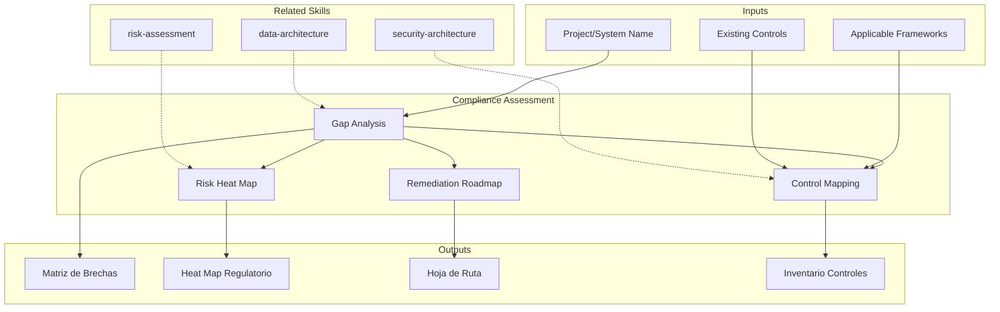

<!-- distilled from alfa skills/compliance-assessment -->
<!-- Regulatory and standards compliance assessment — GDPR, SOX, PCI-DSS, HIPAA, ISO 27001, NIST CSF. [EXPLICIT] -->
# Compliance Assessment: Regulatory & Standards Gap Analysis

Compliance assessment identifies gaps between an organization's current practices and applicable regulatory or standards requirements. The skill produces compliance gap matrices, remediation roadmaps, and risk heat maps that enable informed prioritization of compliance investments. [EXPLICIT]

## Grounding Guideline

> *Compliance without evidence is a statement of intentions. Compliance with evidence is a guarantee.*

1. **Traceable evidence.** Every control must have verifiable evidence, not just declarative documentation. [EXPLICIT]
2. **Regulation as a design constraint.** Regulatory requirements are not added at the end — they are incorporated from the start. [EXPLICIT]
3. **The cost of non-compliance always exceeds the cost of compliance.** Fines, sanctions, and loss of trust are exponentially more expensive than compliance investment. [EXPLICIT]

## TL;DR

- Evaluates compliance status against applicable regulatory frameworks (GDPR, SOX, PCI-DSS, HIPAA, ISO 27001)
- Generates gap matrix with severity, remediation effort, and residual risk
- Produces remediation roadmap prioritized by regulatory impact and risk exposure
- Maps existing controls against regulatory requirements to identify coverage and gaps
- Delivers regulatory risk heat map for executive communication

## Inputs

The user provides a project or system name as `$ARGUMENTS`. Parse `$1` as the **project/system name**. [EXPLICIT]

**Parameters:**
- `{MODO}`: `piloto-auto` (default) | `desatendido` | `supervisado` | `paso-a-paso`
- `{FORMATO}`: `markdown` (default) | `html` | `dual`
- `{VARIANTE}`: `ejecutiva` (~40%) | `tecnica` (full, default)
- `{MARCO}`: `GDPR` | `SOX` | `PCI-DSS` | `HIPAA` | `ISO-27001` | `NIST-CSF` | `multi` (default)

## Deliverables

1. **Compliance Gap Matrix** — Control-by-control gap analysis against selected framework(s)
2. **Remediation Roadmap** — Prioritized action plan with effort estimates, owners, and timelines
3. **Regulatory Risk Heat Map** — Visual risk assessment by domain and severity
4. **Existing Controls Inventory** — Mapping of current controls to regulatory requirements
5. **Executive Exposure Report** — C-level summary of compliance posture and key risks

## Process

1. **Identify applicable frameworks** — Determine which regulations and standards apply based on industry, geography, data types, and business model
2. **Inventory existing controls** — Catalog current security controls, policies, procedures, and technical safeguards
3. **Map controls to requirements** — Map existing controls against each requirement of the applicable framework(s)
4. **Evaluate gaps** — Identify gaps where controls are missing, partial, or ineffective; classify by severity
5. **Calculate residual risk** — Assess likelihood and impact of non-compliance for each gap
6. **Prioritize remediation** — Rank remediation actions by regulatory exposure, effort, and business impact
7. **Design roadmap** — Build phased remediation plan with quick wins (0-30 days), medium-term (30-90 days), and strategic (90-365 days)
8. **Generate heat map** — Produce visual risk heat map for executive communication

## Severity & Risk Scoring

One scoring method across matrix, heat map, and roadmap — divergent scales between deliverables are the top cause of inconsistency findings. [INFERENCIA]

**Gap severity** = max(control absence, regulatory weight):
- **Critical** — Mandatory control absent AND framework imposes fines/license loss/breach-notification (e.g., GDPR Art. 32 encryption gap, PCI-DSS Req. 3 cardholder data unencrypted). [DOC]
- **High** — Mandatory control partial/ineffective, or compensating control exists but undocumented. [DOC]
- **Medium** — Recommended (not mandatory) control missing, or documentation gap with control operating. [DOC]
- **Low** — Cosmetic/maturity gap; no audit-finding exposure. [DOC]

**Residual risk** = Likelihood (1–5) × Impact (1–5) → heat map band: 1–4 green, 5–9 yellow, 10–14 orange, 15–25 red. Impact anchors to regulatory penalty tier, not engineering effort. [SUPUESTO → confirm penalty tiers per framework with legal counsel before publishing scores]

**Anti-scope (do NOT score):** absolute fine amounts (legal counsel only), probability of enforcement action, insurance/indemnity adequacy. [DOC]

## Quality Criteria

Each item is binary and machine-checkable; partial credit is a fail. [INFERENCIA]

- [ ] All applicable frameworks identified, each with a one-line applicability justification (industry/geo/data-type trigger) [DOC]
- [ ] Gap matrix covers 100% of framework requirements (every control ID present, not sampled) [DOC]
- [ ] Every gap row has: severity, evidence tag, residual-risk score, remediation owner role, effort band [DOC]
- [ ] Heat map and matrix use the single scoring method in "Severity & Risk Scoring" — no scale drift [INFERENCIA]
- [ ] Remediation roadmap items each map to ≥1 gap ID (no orphan actions, no unremediated critical/high gaps) [DOC]
- [ ] Evidence tags applied per references/verification-tags.md Alfa set: [DOC], [CONFIG], [INFERENCIA], [SUPUESTO] [DOC]
- [ ] Mandatory legal disclaimer present and verbatim (see Assumptions) [DOC]
- [ ] Cross-references to related security and architecture assessments resolve [DOC]

## Assumptions and Limits

- **Verbatim disclaimer (mandatory, every output):** "This is a technical compliance gap assessment, not legal advice. Regulatory interpretations and penalty exposure must be validated by qualified legal counsel before action." [DOC]
- Assumes access to documentation of existing controls and policies; absence triggers Edge Case 2. [DOC]
- Does NOT replace formal certification audits (ISO 27001 Stage 2, SOC 2 Type II, PCI QSA RoC); output is pre-audit readiness, not attestation. [DOC]
- Point-in-time snapshot — controls drift; assessment is stale once scope, data flows, or framework versions change. [INFERENCIA]
- Evidence freshness: a control with documentation older than its review cycle is scored "partial," not "present." [SUPUESTO → confirm each org's review cadence]

## Edge Cases

1. **Multiple overlapping frameworks** — GDPR + PCI-DSS + SOX simultaneously: generate a unified control matrix mapping shared requirements (e.g., access logging satisfies all three) to avoid effort duplication. Tag each shared control with all frameworks it discharges. [EXPLICIT]
2. **No control documentation** — Generate inventory from interviews/inference, tag every undocumented control [SUPUESTO] with a verification step, and make "establish control documentation" the first roadmap item. Do not score an undocumented control as "present." [EXPLICIT]
3. **Local regulation outside standard frameworks** — For Ley 1581 (Colombia), LGPD (Brazil), etc., apply the same structure but require user-supplied requirement text; do not infer obligations from analogous frameworks. [EXPLICIT]
4. **Early-stage startup, no formal controls** — Produce a minimum-viable-controls roadmap (pragmatic), not an exhaustive gap analysis; flag deferred requirements explicitly so scope-down is a conscious decision, not an omission. [EXPLICIT]
5. **Conflicting requirements across frameworks** — When two frameworks mandate incompatible controls (e.g., GDPR erasure vs. SOX 7-year retention), do NOT resolve it — surface the conflict as a flagged item routed to legal/DPO with both citations. [INFERENCIA]
6. **Framework version mismatch** — If the org's controls target a superseded version (e.g., PCI-DSS 3.2.1 vs 4.0), assess against the current mandatory version and list version-delta requirements as a distinct remediation cluster. [INFERENCIA]

## Failure Modes

| Failure | Symptom | Guard |
|---|---|---|
| False completeness | Single-framework run presented as "compliant" | Default `multi`; state which frameworks were out of scope [DOC] |
| Undocumented = present | Control assumed effective with no evidence | Edge Case 2; absence of evidence → "partial" max [INFERENCIA] |
| Scale drift | Heat map and matrix disagree on a gap's severity | Single scoring method; QC gate [INFERENCIA] |
| Legal overreach | Output states a fine amount or "you are compliant" | Verbatim disclaimer; anti-scope list [DOC] |
| Orphan remediation | Roadmap action maps to no gap, or critical gap has no action | QC bidirectional gap↔action check [DOC] |
| Stale snapshot reused | Old assessment cited after data flows changed | Date-stamp; flag scope-change invalidation [INFERENCIA] |

## Worked Example (abridged)

Input: `payment-gateway` · `{MARCO}=multi` (PCI-DSS + GDPR). [SUPUESTO illustrative]

| Req | Control state | Sev | L×I | Tag | Remediation (owner, band) |
|---|---|---|---|---|---|
| PCI 3.4 (PAN encryption) | Absent | Critical | 5×5=25 | [CONFIG] | Tokenize PAN at ingress (Sec Eng, 30–90d) |
| GDPR Art.30 (RoPA) | Partial, undocumented | High | 4×3=12 | [SUPUESTO] | Document processing register (DPO, 0–30d) |
| PCI 10.2 (audit logs) | Present, satisfies GDPR Art.32 too | — | — | [DOC] | None — shared control, mapped twice |

Roadmap: quick win = RoPA doc (0–30d); core = tokenization (30–90d). No orphan actions; one critical gap → one action. [INFERENCIA]

## Decisions and Trade-offs

1. **Multi-framework default vs. single framework** — Default multi because most organizations are subject to multiple regulations; a single framework creates a false sense of completeness. [EXPLICIT]
2. **100% gap analysis vs. sampling** — 100% coverage of framework requirements is required because external auditors evaluate against the entirety; sampling is insufficient for certification. [EXPLICIT]
3. **Visual heat map vs. detailed table** — Both are produced: heat map for executive communication and detailed table for remediation teams; the additional cost is justified by the different audiences. [EXPLICIT]
4. **Mandatory legal disclaimer vs. optional** — Always mandatory; the skill produces technical evaluation, never legal advice, and this must be explicit to protect the user. [EXPLICIT]

## Knowledge Graph

## Output Templates

### Markdown (default)
- Filename: `compliance_gap-analysis_{sistema}_{WIP}.md`
- Structure: TL;DR -> Marcos aplicables -> Matriz de brechas (tabla) -> Heat map (Mermaid) -> Roadmap de remediacion -> Informe ejecutivo

### HTML (bajo demanda)
- Filename: `compliance_gap-analysis_{sistema}_{WIP}.html`
- Estructura: HTML self-contained branded (Design System MetodologIA v5). Light-First Technical. Incluye risk heat map interactivo por dominio, compliance matrix filtrable, y remediation roadmap faseado. WCAG AA, responsive, print-ready.

### XLSX
- Filename: `compliance_control-matrix_{sistema}_{WIP}.xlsx`
- Hojas: Framework Requirements | Control Inventory | Gap Matrix | Risk Scoring | Remediation Plan

### DOCX (bajo demanda)
- Filename: `{fase}_compliance_gap-analysis_{sistema}_{WIP}.docx`
- Via python-docx con Design System MetodologIA v5. Cover page, TOC auto, headers/footers branded, tablas zebra. Poppins headings (navy), Trebuchet MS body, gold accents.

### PPTX (bajo demanda)
- Filename: `{fase}_{entregable}_{cliente}_{WIP}.pptx`
- Via python-pptx con MetodologIA Design System v5. Slide master con gradiente navy, titulos Poppins, cuerpo Trebuchet MS, acentos gold. Max 20 slides (ejecutiva) / 30 slides (tecnica). Speaker notes con referencias de evidencia. Para comites directivos y presentaciones C-level.

## Evaluacion

| Dimension | Peso | Criterio |
|-----------|------|----------|
| Trigger Accuracy | 10% | Activa ante "compliance", "GDPR", "PCI-DSS", "regulatory" sin confundir con security assessment general |
| Completeness | 25% | Cubre identificacion de marcos, gap analysis, heat map y roadmap sin huecos |
| Clarity | 20% | Cada brecha referencia requisito especifico con severidad y remediacion concreta |
| Robustness | 20% | Maneja multi-framework, ausencia de documentacion y regulaciones locales |
| Efficiency | 10% | 8 pasos secuenciales donde cada uno usa output del anterior |
| Value Density | 15% | Heat map y roadmap son directamente presentables a C-level y equipos tecnicos |

**Umbral minimo**: 7/10 en cada dimension para considerar el skill production-ready.

## Cross-References

- **metodologia-security-architecture:** Security controls that support compliance requirements
- **metodologia-data-architecture:** Data governance and classification relevant to GDPR/HIPAA
- **metodologia-risk-assessment:** Enterprise risk framework aligned with compliance risks

---
**Autor:** Javier Montaño · Comunidad MetodologIA | **Version:** 1.0.0

## Usage

Example invocations:

- "/compliance-assessment" — Run the full compliance assessment workflow
- "compliance assessment on this project" — Apply to current context
