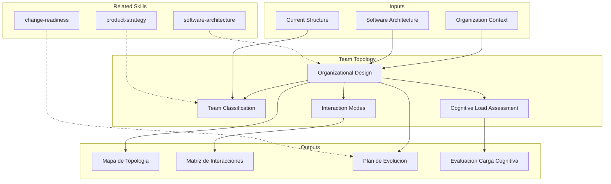

<!-- distilled from alfa skills/team-topology -->
<!-- Conway's Law analysis, team interaction modes, cognitive load assessment, organizational design. [EXPLICIT] -->
# Team Topology: Organizational Design for Fast Flow

Team topology designs organizational structures that optimize for fast flow of change while managing cognitive load. The skill produces team topology maps, interaction matrices, and evolution plans based on the Team Topologies framework (Skelton & Pais). [EXPLICIT]

## Grounding Guideline

> *Software architecture reflects team architecture. Change one without changing the other and the system will resist.*

1. **Conway's Law is not a suggestion — it is a law.** Teams produce designs that mirror their communication structure. [EXPLICIT]
2. **Cognitive load as a design constraint.** If a team cannot comprehend its entire domain, the domain is poorly partitioned. [EXPLICIT]
3. **Deliberate interactions.** Interaction modes between teams (collaboration, X-as-a-Service, facilitation) must be explicit and designed. [EXPLICIT]

## TL;DR

- Analyzes Conway's Law: how the current organizational structure conditions software architecture
- Classifies teams into the 4 fundamental types: stream-aligned, platform, enabling, complicated-subsystem
- Evaluates cognitive load per team to detect overload and excessive dependencies
- Maps interaction modes (collaboration, X-as-a-service, facilitation) with temporal evolution
- Produces organizational evolution plan aligned with target architecture

## Inputs

The user provides an organization or department name as `$ARGUMENTS`. Parse `$1` as the **organization/department name**. [EXPLICIT]

**Parameters:**
- `{MODO}`: `piloto-auto` (default) | `desatendido` | `supervisado` | `paso-a-paso`
- `{FORMATO}`: `markdown` (default) | `html` | `dual`
- `{VARIANTE}`: `ejecutiva` (~40%) | `tecnica` (full, default)
- `{HORIZONTE}`: `6m` | `12m` (default) | `24m`

**Minimum viable input to start.** Org/department name + a list of current teams with rough sizes. Without team-to-architecture mapping the Conway analysis degrades to `[SUPUESTO]`; without value streams the stream-aligned boundaries are inferred and must be flagged `[INFERENCIA]`. [INFERENCIA]
**Anti-scope (do NOT do).** No headcount/RIF planning, no individual performance assessment, no compensation bands, no formal HR reporting-line redesign — those belong to People Ops. This skill designs *flow*, not org-chart authority. [EXPLICIT]

## Deliverables

1. **Team topology map** — Visual map of all teams classified by type with ownership boundaries
2. **Interaction matrix** — Team-to-team interaction modes (collaboration, X-as-a-service, facilitating) with expected evolution
3. **Evolution plan** — Phased plan to evolve from current to target topology with milestones and change management
4. **Cognitive load assessment** — Per-team cognitive load assessment with overload indicators and remediation
5. **Conway analysis** — Mapping of current org structure to software architecture with misalignment identification

## Process

1. **Map current structure** — Document current teams, their responsibilities, sizes, and reporting lines
2. **Analyze Conway's Law** — Map how current team boundaries reflect (or conflict with) the software architecture
3. **Classify teams** — Categorize each team: stream-aligned (business capability), platform (internal services), enabling (capability uplift), complicated-subsystem (deep expertise)
4. **Evaluate cognitive load** — Score each team on intrinsic (domain complexity), extraneous (tooling/process overhead — the only one you should actively shrink), and germane (learning toward the goal). Use a proxy score, not gut feel (see Cognitive Load Scoring). [EXPLICIT]
5. **Identify anti-patterns** — Detect: teams too large (>9), too many dependencies, shared ownership, siloed knowledge, handoff chains (see Failure Modes for thresholds and the move each one forces). [EXPLICIT]
6. **Design target topology** — Define target team structure aligned with desired architecture and value streams. Stream-aligned teams are the default and majority; the other three types exist only to reduce a stream-aligned team's load. [EXPLICIT]
7. **Map interactions** — Define interaction mode per team pair: collaboration (temporary, high-bandwidth, weeks→one quarter max), X-as-a-service (API-like, low-coupling, the steady state), facilitating (enabling team helps others, time-boxed to the uplift). A pair stuck in collaboration past a quarter is an unresolved boundary, not a mode. [EXPLICIT]
8. **Plan evolution** — Create phased transition plan with organizational change management, communication, and success metrics. Sequence: reduce load first (split or platformize), *then* rewire interactions — never both for the same team in one phase. [INFERENCIA]

## Cognitive Load Scoring

Proxy score per team; cap a single stream-aligned team at one comprehensible domain. Score = sum of weighted indicators; treat >12 as overloaded, 8–12 as watch, <8 as healthy. [SUPUESTO] — calibrate the threshold against two known-healthy and two known-overloaded teams in the org before trusting it; verification step: retro velocity + on-call pages correlate with the score.

| Indicator | Weight | Reads as overload when |
|---|---|---|
| Distinct business domains owned | ×3 | > 1 |
| Services/repos on-call for | ×1 | > 5 |
| Synchronous dependencies to ship | ×2 | > 2 teams |
| Distinct tech stacks maintained | ×2 | > 2 |
| Context-switches/week (interrupt classes) | ×1 | > 3 |

Worked example — "Payments" team (9 eng): 2 domains (payments + fraud) ×3 = 6, 7 services ×1 = 7, deps on Platform+Identity (2) ×2 = 4 → already 17 before stacks. Diagnosis: overloaded. Move: split fraud into its own stream-aligned team, or absorb fraud's deep ML rules into a complicated-subsystem team so Payments keeps one domain. [INFERENCIA]

## Quality Criteria

- [ ] All teams classified into one of the 4 fundamental types
- [ ] Cognitive load assessed per team with quantitative indicators (domains owned, services maintained)
- [ ] Interaction modes defined for all significant team pairs
- [ ] Evolution plan includes intermediate states (not just current and target)
- [ ] Conway's Law analysis identifies architecture-organization misalignments
- [ ] Team sizes within recommended bounds (5-9 members)
- [ ] Dependencies between teams explicitly mapped and minimized
- [ ] Change management considerations included in evolution plan
- [ ] Every overloaded team (score > 12) has exactly one named remediation move
- [ ] Evolution plan obeys the rule: no team changes both its load *and* its interactions in the same phase
- [ ] At least one fitness function defined so the change is measurable post-rollout

## Assumptions & Limits

- Assumes leadership support for organizational restructuring; without it, deliver the analysis but mark the evolution plan `[SUPUESTO]` and gate it on a sponsor. [INFERENCIA]
- Team topology is a model — real organizations have nuances the model simplifies
- Does not address HR, compensation, or formal reporting line changes (see Anti-scope)
- Effectiveness depends on alignment between architecture evolution and team evolution; if architecture is not also moving, this produces an org chart, not a topology. [INFERENCIA]
- Not for teams < ~4 people total — there is nothing to partition; the output collapses to a single stream-aligned team plus a watch-list of future splits. [INFERENCIA]

## Edge Cases

1. **Organizacion con estructura matricial rigida** — Cuando los reportes funcionales no pueden cambiar, el skill propone topologias virtuales (squads cross-funcionales) que operan dentro de la estructura formal, con mecanismos de alineacion dual. [EXPLICIT]
2. **Equipo unico responsable de todo (startup temprana)** — El skill no fuerza los 4 tipos; en su lugar identifica responsabilidades que deberian separarse primero y define triggers de division basados en carga cognitiva medible. [EXPLICIT]
3. **Fusion o adquisicion con equipos duplicados** — El skill mapea capacidades duplicadas, propone consolidacion basada en fortalezas complementarias y disena plan de transicion que minimiza perdida de conocimiento institucional. [EXPLICIT]
4. **Equipos distribuidos en multiples paises con diferencia cultural** — La matriz de interacciones se ajusta por zona horaria y cultura de comunicacion, priorizando X-as-a-service sobre colaboracion para minimizar dependencia de comunicacion sincrona. [EXPLICIT]

## Failure Modes (anti-patterns → forced move)

| Anti-pattern | Detection threshold | Forced move |
|---|---|---|
| Team too large | > 9 members | Split along a domain seam, not by function. [EXPLICIT] |
| Dependency overload | > 2 sync deps to ship | Convert the most-blocking dep to X-as-a-service; if it cannot be API-ized, the boundary is wrong — re-cut it. [INFERENCIA] |
| Shared ownership | 2+ teams own one service | Assign single owner; others consume via API. Shared ownership = no ownership. [EXPLICIT] |
| Siloed knowledge | bus-factor = 1 on a domain | Time-boxed enabling-team rotation, then leave. [INFERENCIA] |
| Handoff chain | > 1 handoff per change | Collapse the chain into one stream-aligned team or platformize the intermediate step. [INFERENCIA] |
| Platform-as-bottleneck | every stream blocked on platform tickets | Platform must expose self-service (X-as-a-service); ticket queue is the smell. [INFERENCIA] |
| Permanent collaboration | a pair collaborating > 1 quarter | Promote to a merged team or demote to X-as-a-service; collaboration is a transition, not a destination. [EXPLICIT] |

**Fitness functions** (track post-change, not just at design time): lead-time for change per stream-aligned team, % of work shippable without a sync dependency, platform self-service adoption %, cognitive-load score trend. A topology that doesn't move these is decorative. [INFERENCIA]

## Decisions & Trade-offs

1. **4 tipos de equipo vs. taxonomia libre** — Se usa el framework de Skelton & Pais porque provee vocabulario compartido y anti-patrones documentados; taxonomia libre genera ambiguedad organizacional. [EXPLICIT]
2. **Carga cognitiva como metrica principal vs. delivery velocity** — Carga cognitiva porque es la causa raiz; velocity baja es frecuentemente el sintoma de sobrecarga cognitiva, no de falta de capacidad. [EXPLICIT]
3. **Evolucion incremental vs. reorganizacion big-bang** — Incremental siempre, porque reorganizaciones big-bang destruyen redes informales de conocimiento y generan 3-6 meses de baja productividad. [EXPLICIT]
4. **Tamano maximo de equipo 9 vs. flexible** — Hard limit en 9 (Dunbar's sub-group) porque equipos mas grandes pierden cohesion y aumentan overhead de comunicacion cuadraticamente. [EXPLICIT]

## Knowledge Graph

## Output Templates

### Markdown (default)
- Filename: `org_team-topology_{departamento}_{WIP}.md`
- Structure: TL;DR -> Analisis Conway -> Mapa de topologia (Mermaid) -> Matriz de interacciones (tabla) -> Carga cognitiva -> Plan de evolucion

### PPTX
- Filename: `org_team-topology_{departamento}_{WIP}.pptx`
- Slides: Current State (mapa actual) -> Conway Analysis -> Target Topology -> Interaction Modes -> Cognitive Load Findings -> Evolution Roadmap

### DOCX (bajo demanda)
- Filename: `{fase}_team-topology_{departamento}_{WIP}.docx`
- Generado con python-docx y MetodologIA Design System v5. Portada con nombre del departamento/organización y fecha, TOC automático, encabezados Poppins navy, cuerpo Trebuchet MS, acentos dorados, tablas zebra. Secciones: Análisis Conway, Mapa de Topología de Equipos, Matriz de Interacciones, Evaluación de Carga Cognitiva, Plan de Evolución Organizacional.

### HTML (bajo demanda)
- Filename: `org_team-topology_{departamento}_{WIP}.html`
- Estructura: HTML self-contained branded (Design System MetodologIA v5). Light-First Technical. Incluye diagrama interactivo de mapa de topología de equipos, matriz de interacciones con modos coloreados, y radar de carga cognitiva por equipo. WCAG AA, responsive, print-ready.

### XLSX (bajo demanda)
- Filename: `{fase}_team-topology_{departamento}_{WIP}.xlsx`
- Generado con openpyxl y MetodologIA Design System v5. Encabezados con fondo navy y texto Poppins blanco, formato condicional por tipo de equipo y nivel de carga cognitiva, auto-filtros en todas las columnas, valores calculados sin fórmulas. Hojas: Clasificación de Equipos, Matriz de Interacciones, Evaluación de Carga Cognitiva, Plan de Evolución.

## Evaluacion

| Dimension | Peso | Criterio |
|-----------|------|----------|
| Trigger Accuracy | 10% | Activa ante "team topology", "cognitive load", "Conway's Law", "stream-aligned" sin confundir con org chart o HR planning |
| Completeness | 25% | Cubre clasificacion, interacciones, carga cognitiva, Conway y plan de evolucion |
| Clarity | 20% | Cada equipo tiene tipo, boundaries y responsabilidades sin ambiguedad |
| Robustness | 20% | Maneja estructura matricial, startups, fusiones y equipos distribuidos |
| Efficiency | 10% | 8 pasos donde estructura actual alimenta analisis que alimenta diseno objetivo |
| Value Density | 15% | Mapa de topologia y plan de evolucion son presentables a liderazgo |

**Umbral minimo**: 7/10 en cada dimension para considerar el skill production-ready.

## Cross-References

- **metodologia-software-architecture:** Architecture that team topology must align with (reverse Conway maneuver)
- **metodologia-change-readiness-assessment:** Organizational readiness for team restructuring
- **metodologia-product-strategy:** Value streams that drive stream-aligned team boundaries

---
**Autor:** Javier Montaño · Comunidad MetodologIA | **Version:** 1.1.0

## Usage

Example invocations:

- "/team-topology" — Run the full team topology workflow
- "team topology on this project" — Apply to current context
